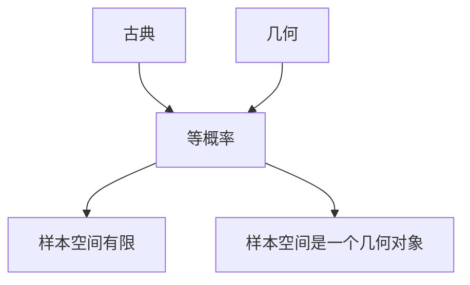
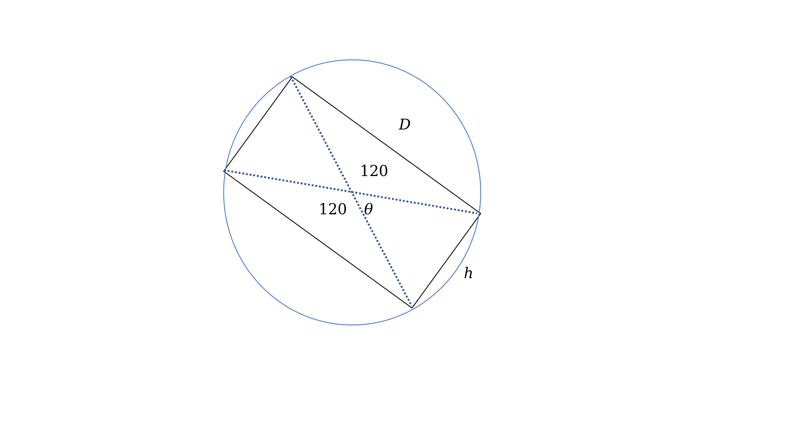
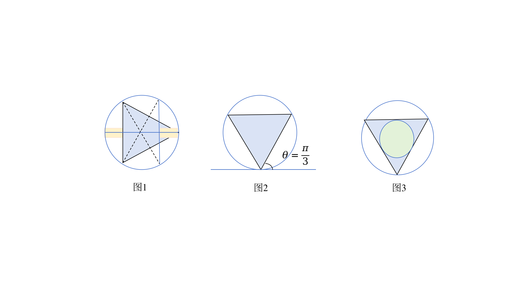

Review: 
$(\Omega,\mathcal{F},P)$
$\Omega:$ 样本空间, 集合
$P: \mathcal{F} \rightarrow \mathbb{R}$

### 例子: 
#### 放回抽样
袋中有$N$个白球, 袋中有$n$个红球, $N-n$个白球, 则摸到红球的概率是多少
$P(红)=P(\{1,\dots,n\})$
古典概型
$$
P(A)=\frac{\#A}{\#\Omega} 
$$
其中,$\#A$表示集合$A$中元素的个数, $\# \Omega$表示样本空间中的元素个数.
$P(红)=\frac{n}{N}, P(白)=1-\frac{n}{N}$

##### 摸$k$个球
$\Omega_{k}=\{(x_{1},\ldots,x_{k})| x_{1},\ldots,x_{k} \in \{1,\ldots,N\} \} = \Omega^k$
$A=\{k个球中有l个红的\}$
$A=\{(x_{1},\ldots,x_{k})| \#\{x_{i}| i=1,\dots,k, x_{i} \leq n \}=l \}$
$$
\frac{\#A}{\#\Omega} = P(A)
$$
放回抽样, 各次试验互相独立, 且每次抽到红球的概率相同,我们关注的是抽到红球的总次数, 与其第几次被抽出没有关系. 于是先考虑一种情况, 也就是 $k$次实验中, 前 $l$个为红球, 后 $k-l$个是白的.一共有 $n^l(N-n)^{k-l}$
结合红球的"位置", 那么
$$
\# A =
\begin{pmatrix}
k \\
l
\end{pmatrix} n^l(N-n)^{k-l}
$$
带入
$$
\frac{\#A}{\#\Omega} = P(A) = \frac{\begin{pmatrix}
k \\
l
\end{pmatrix} n^l(N-n)^{k-l}}{N^lN^{k-l}}
$$
记做: $\frac{n}{N}=p$, 则上式
$$
\frac{\#A}{\#\Omega}= \begin{pmatrix}
k \\
l
\end{pmatrix} p^l(1-p)^{k-l}
$$

更一般地, 实验$\Omega = \{是, 否\}$

$(\Omega, \mathcal{F}=\mathcal{P}(\Omega),P)$

$P(\{是\})=p$, $P({否})=1-p$

这称为Bernoulli实验. 

独立地进行$k$次Bernoulli实验, 结果中有$l$个"是"的概率:
$$
\begin{pmatrix}  
k \\  
l  
\end{pmatrix}p^l(1-p)^{k-l}
$$
#### 不放回抽样
球: 1 到 $N$编号

红: 1 到 $n$ 编号

白: $n+1,\ldots,N$
##### Q: 摸$k$次, 不放回, 问有$l$个红的概率
$\Omega = \{N中的k元排列\}$
$$\#\Omega=N(N-1)\ \ldots(N-k+1)=k!\begin{pmatrix}  
N\\  
k  
\end{pmatrix} $$
想象有两个盒子, 将盒子一分为2, 左边是$n$个红球, 右边是$N-n$个白球.
先从左边摸$l$个红球, 再从右边摸$k-l$个白球.
$$
\# A =k!\begin{pmatrix}  
n \\  
l  
\end{pmatrix}
\begin{pmatrix}  
N-n \\  
k-l  
\end{pmatrix}
$$
$$P(A_{k,l})= \frac{\begin{pmatrix}  
n \\  
l  
\end{pmatrix}\begin{pmatrix}  
N-n \\  
k-l  
\end{pmatrix}}{\begin{pmatrix}  
N \\  
k  
\end{pmatrix}}$$
1. 若$k>N$ , 不行, $\Longrightarrow k \leq N$
2. $若 l>n$, 则$p=0$.
(自行结合物理含义理解)

$\Omega=A_{k,0}\cup \dots\cup A_{k,k}$ 其中, $A_{k,l_{1}} \cap A_{k,l_{2}}=\emptyset$, $l_{1}\neq l_2$
$$1=\sum_{l=0}^{k}P(A_{k,l})$$
$$
1 =\sum_{l=0}^{k}\frac{\begin{pmatrix}  
n \\  
l  
\end{pmatrix}\begin{pmatrix}  
N-n \\  
k-l  
\end{pmatrix}}{\begin{pmatrix}  
N \\  
k  
\end{pmatrix}}
$$
$$
\begin{pmatrix}  
N \\  
k  
\end{pmatrix} = \sum^{k}_{l=0}\begin{pmatrix}  
n \\  
l  
\end{pmatrix}\begin{pmatrix}  
N-n \\  
k-l  
\end{pmatrix}
$$
$$
\Longleftrightarrow 
(1+x)^N 的x^k的系数 = (1+x)^n(1+x)^N中x^k的系数
$$

统计物理的模型:
麦克斯韦–玻尔兹曼模型(Maxwell–Boltzmann model)
玻色-爱因斯坦模型(Bose–Einstein statistics or Bose–Einstein distribution)
费米-狄拉克模型(Fermi–Dirac statistics)

上述模型都类似于盒子里放球
#### 生日悖论
$\Omega_{n}=\Omega^n$

$\# \Omega=N^n$

$\#A=N(N-1)\cdots(N-n+1)$
见birthday_paradox.py文件

### 几何概率
$P(A)=\frac{m(A)}{m(\Omega)}$
其中, $m(A)$表示集合$A$的测度, $m(\Omega)$表示样本空间的测度.

[Buffon's needle problem](https://en.wikipedia.org/wiki/Buffon%27s_needle_problem)
针长 $l$, 线间距 $d$, 则 $d >l$
问: 相交的概率

假设线是水平且平行的. 关于针的三条信息为: 中点的(x,y)坐标, 以及绕水平方向逆时针旋转的角度 $\theta$. 由于平移并不会改变"相交的情况". 所以可以简化信息: 
$0 \leq y \leq \frac{d}{2}$

$0 \leq \theta \leq\pi$

$\Omega=\{(y,\theta) | 0 \leq y \leq \frac{d}{2}, 0 \leq\theta \leq \pi   \}$

$A= \{(y,\theta) \in \Omega | \frac{y}{\sin\theta} \leq \frac{l}{2}\}$

这里 $m(\Omega)$实际上是长为 $\pi$, 宽为 $\frac{d}{2}$的长方形的面积(这里 $\theta$为横轴, $y$为竖轴). 

$P(A)=\frac{m(A)}{m(\Omega)}=\frac{\frac{l}{2}\int^{\pi}_{0}\sin\theta d\vartheta}{\pi \frac{d}{2}}=\frac{2l}{\pi d}$

#### [公平硬币问题](https://www.bilibili.com/video/BV1cZfCBzEev/?share_source=copy_web&vd_source=2ecc986967d3b607a26433a8b2c5a528)
Yong E H, Mahadevan L. Probability, geometry, and dynamics in the toss of a thick coin[J]. American Journal of Physics, 2011, 79(12): 1195-1201.

如何设计这枚硬币, 使得 $正面的概率=反面的概率=侧立的概率$
$\Omega=[0,\pi]$

$\theta=\frac{\pi}{3}$

$D= \sqrt{3}*h$

#### Bertand 悖论
圆中取弦问题. 圆中随机取弦, 其长度$>$内接等边三角形的边的概率. 
$\Omega,\mathcal{F},P$
P应该如何取?
1. 作直径的垂线    $\frac{1}{2}$
2. 作圆的外切线, 随后是逆时针旋转,作与外切线夹角为$\theta$的弦. 平角三等分. 落在中间的弦较长, 而落在两边较短.  $\frac{1}{3}$
3. 过圆内任何一点都可以以这个点为中点作弦. 作这个圆(半径为R)内接等边三角形的内切圆. 这个内切圆的半径为$\frac{R}{2}$. 这时候比值为内切圆和大圆的面积之比. 得到答案为 $\frac{1}{4}$.

隐含着不同的密度. 

重积分换元
$$
\iint_{D} f(x,y)\,dx\,dy
=
\iint_{D'} f\bigl(x(u,v),\,y(u,v)\bigr)
\left|
\frac{\partial(x,y)}{\partial(u,v)}
\right|
\,du\,dv

$$
上述不同的几何选取蕴含着不同的Jacobi.

## 概率的性质
$(\Omega,\mathcal{F},P)$

$0 \leq P(A) \leq 1$

$P( \emptyset )=0$

$P( \Omega )=1$

单调性
若$A \subseteq B$, $A,B \in \mathcal{F}$

则 $P(A) \leq P(B)$

$B=A \cup (B-A)$

$P(B)=P(A)+P(B-A)$

$P(A)=P(B)-P(B-A)$

$P(B-A)=P(B)-P(A)$

对任意 $A,B \in \mathcal{F}$, $P(A \cup B)=P(A)+P(B)-P(A \cap B)$
$A \cup B = (A-A\cap B)\cup(A \cap B) \cup(B-A\cap B)$
$P(A \cup B \cup C)=P(A)+P(B)+P(C)-P(A \cap B)-P(B \cap C)-P(C \cap A) + P(A \cap B \cap C)$

#### 例 最大编号问题

袋中有 $1,....,n$ 个球, 随机抽 $m$ 个(有放回), 问: 其中最大编号是$k$的概率?
##### 方法一
样本空间 $\Omega=\{1,\dots,n\}^m =\{(x_{1},\ldots,x_{m})| x_{1},\ldots,x_{m} \in \{1,\ldots,n\} \}$. 
记$A_{k}$是最大编号为$k$的事件, $A_{k,l}$ 表示 $k$ 出现了$l$次.
$A_{k}=A_{k,1} \cup A_{k,2} \cup \ldots \cup A_{k,m}$

$$P(A_{k,l})=\begin{pmatrix}  
m \\  
l  
\end{pmatrix}(\frac{1}{n})^{l}(\frac{k-1}{n})^{m-l}
$$
$$
\begin{align}
P(A_{k}) &=\sum_{l=1}^{m} \begin{pmatrix}  
m \\  
l  
\end{pmatrix}(\frac{1}{n})^{l}(\frac{k-1}{n})^{m-l} \\
&=\sum_{l=0}^{m} \begin{pmatrix}  
m \\  
l  
\end{pmatrix}(\frac{1}{n})^{l}(\frac{k-1}{n})^{m-l}-(\frac{k-1}{n})^{m}
 \\ 
&= (\frac{k}{n})^m-(\frac{k-1}{n})^{m}
\end{align}

$$

##### 方法二
记$B_{k}$为最大编号 $\leq k$ 的事件
$P(B_{k})=(\frac{k}{n})^m$

$A_{k}=B_{k}-B_{k-1}$

容斥原理
#### 例  装错信封问题
有 $n$ 封信且有对应的信封, 问 $n$封信都装错的概率. 记$A_{i}$为第$i$封信装对了的事件

$$
\begin{align}
P(\overline{A_{1} \cup A_{2} \cup \ldots \cup A_{n}}) &=1-P(A_{1}\cup A_{2}\ldots A_{n} ) \\
&=1-P(A_{1}) \ldots-P(A_{n}) + \sum_{i<j}P(A_{i} \cap A_{j}) 
-\sum_{i<j<k}P(A_{i} \cap A_{j}\cap A_{k})+\dots+(-1)^nP(A_{1}\cap \ldots A_{n})
\end{align}
$$

$P(A_{1})=\frac{1}{n}$

$P(A_{1} \cap A_{2})=\frac{1}{n}\frac{1}{n-1}$

$P(A_{1} \cap A_{2} \ldots \cap A_{k})=\frac{1}{n(n-1)\ldots(n-k+1)  }$

继续回到上式

$$
\begin{align}
P(\overline{A_{1} \cup A_{2} \cup \ldots \cup A_{n}}) &= 1-n* \frac{1}{n}+\begin{pmatrix}  
n \\  
2  
\end{pmatrix}\frac{1}{n(n-1)} -\begin{pmatrix}  
n \\  
3  
	\end{pmatrix}\frac{1}{n(n-1)(n-2)}+ \ldots+(-1)^n\frac{1}{n!}
 \\
&=1-1+\frac{1}{2!}-\frac{1}{3!}+\ldots+\frac{(-1)^n}{n}
\end{align}
$$

