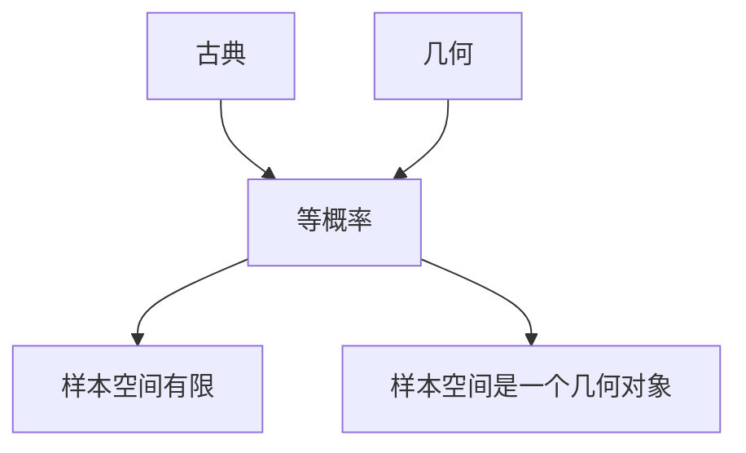

Review: 
$(\Omega,\mathcal{F},P)$
$\Omega:$ 样本空间, 集合
$P: \mathcal{F} \rightarrow \mathbb{R}$

### 例子: 
#### 放回抽样
袋中有$N$个白球, 袋中有$n$个红球, $N-n$个白球, 则摸到红球的概率是多少
$P(红)=P(\{1,\dots,n\})$
古典概型
$$
P(A)=\frac{\#A}{\#\Omega} 
$$
其中,$\#A$表示集合$A$中元素的个数, $\# \Omega$表示样本空间中的元素个数.
$P(红)=\frac{n}{N}, P(白)=1-\frac{n}{N}$

##### 摸$k$个球
$\Omega_{k}=\{(x_{1},\ldots,x_{k})| x_{1},\ldots,x_{k} \in \{1,\ldots,N\} \} = \Omega^k$
$A=\{k个球中有l个红的\}$
$A=\{(x_{1},\ldots,x_{k})| \#\{x_{i}| i=1,\dots,k, x_{i} \leq n \}=l \}$
$$
\frac{\#A}{\#\Omega} = P(A)
$$
放回抽样, 各次试验互相独立, 且每次抽到红球的概率相同,我们关注的是抽到红球的总次数, 与其第几次被抽出没有关系. 于是先考虑一种情况, 也就是$k$次实验中, 前$l$个为红球, 后$k-l$个是白的.一共有 $n^l(N-n)^{k-l}$
结合红球的"位置", 那么
$$
\# A =
\begin{pmatrix}
k \\
l
\end{pmatrix} n^l(N-n)^{k-l}
$$
带入
$$
\frac{\#A}{\#\Omega} = P(A) = \frac{\begin{pmatrix}
k \\
l
\end{pmatrix} n^l(N-n)^{k-l}}{N^lN^{k-l}}
$$
记做: $\frac{n}{N}=p$, 则上式
$$
\frac{\#A}{\#\Omega}= \begin{pmatrix}
k \\
l
\end{pmatrix} p^l(1-p)^{k-l}
$$

更一般地, 实验$\Omega = \{是, 否\}$

$(\Omega, \mathcal{F}=\mathcal{P}(\Omega),P)$

$P(\{是\})=p$, $P({否})=1-p$

这称为Bernoulli实验. 

独立地进行$k$次Bernoulli实验, 结果中有$l$个"是"的概率:
$$
\begin{pmatrix}  
k \\  
l  
\end{pmatrix}p^l(1-p)^{k-l}
$$
#### 不放回抽样
球: 1 到 $N$编号

红: 1 到 $n$ 编号
白: $n+1,\ldots,N$
##### Q: 摸$k$次, 不放回, 问有$l$个红的概率
$\Omega = \{N中的k元排列\}$
$$\#\Omega=N(N-1)\ \ldots(N-k+1)=k!\begin{pmatrix}  
N\\  
k  
\end{pmatrix} $$
想象有两个盒子, 将盒子一分为2, 左边是$n$个红球, 右边是$N-n$个白球.
先从左边摸$l$个红球, 再从右边摸$k-l$个白球.
$$
\# A =k!\begin{pmatrix}  
n \\  
l  
\end{pmatrix}
\begin{pmatrix}  
N-n \\  
k-l  
\end{pmatrix}
$$
$$P(A_{k,l})= \frac{\begin{pmatrix}  
n \\  
l  
\end{pmatrix}\begin{pmatrix}  
N-n \\  
k-l  
\end{pmatrix}}{\begin{pmatrix}  
N \\  
k  
\end{pmatrix}}$$
1. 若$k>N$ , 不行, $\Longrightarrow k \leq N$
2. $若 l>n$, 则$p=0$.
(自行结合物理含义理解)

$\Omega=A_{k,0}\cup \dots\cup A_{k,k}$ 其中, $A_{k,l_{1}} \cap A_{k,l_{2}}=\emptyset$, $l_{1}\neq l_2$
$$1=\sum_{l=0}^{k}P(A_{k,l})$$
$$
1 =\sum_{l=0}^{k}\frac{\begin{pmatrix}  
n \\  
l  
\end{pmatrix}\begin{pmatrix}  
N-n \\  
k-l  
\end{pmatrix}}{\begin{pmatrix}  
N \\  
k  
\end{pmatrix}}
$$
$$
\begin{pmatrix}  
N \\  
k  
\end{pmatrix} = \sum^{k}_{l=0}\begin{pmatrix}  
n \\  
l  
\end{pmatrix}\begin{pmatrix}  
N-n \\  
k-l  
\end{pmatrix}
$$
$$
\Longleftrightarrow 
(1+x)^N 的x^k的系数 = (1+x)^n(1+x)^N中x^k的系数
$$

统计物理的模型:
麦克斯韦–玻尔兹曼模型(Maxwell–Boltzmann model)
玻色-爱因斯坦模型(Bose–Einstein statistics or Bose–Einstein distribution)
费米-狄拉克模型(Fermi–Dirac statistics)

上述模型都类似于盒子里放球
#### 生日悖论
$\Omega_{n}=\Omega^n$

$\# \Omega=N^n$
$\#A=N(N-1)\cdots(N-n+1)$
见birthday_paradox.py文件
